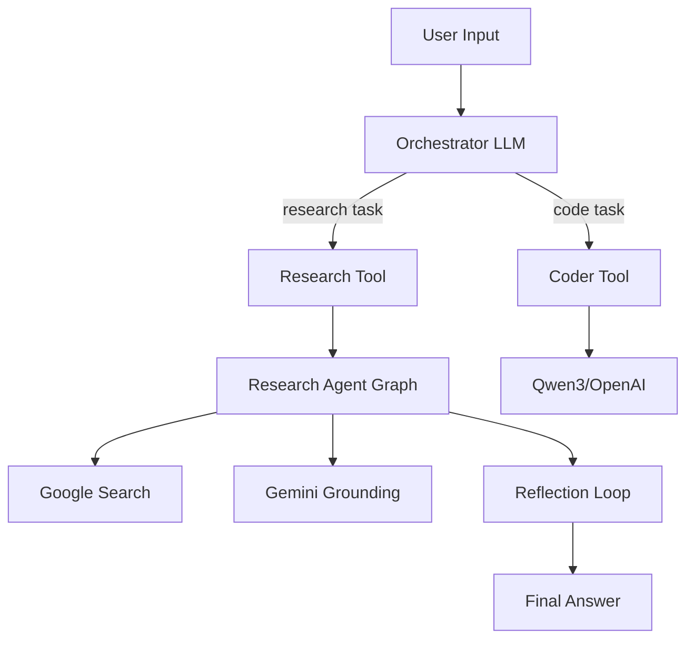

# Utasítások Jules Kódoló Ügynöknek

Kedves Jules! 👋

Ez a BrunellaAgentsSystem projekt – egy LangGraph alapú többügynökös AI rendszer kutatási és kódgenerálási képességekkel. Egy alapos auditon és javításon esett át, most a következő szintre kell emelni.

## 🎯 Fő Feladatok Prioritás Szerint

### 1. KRITIKUS – Hitelesítés és Biztonság

**Probléma:** A költséges LLM végpontok (`/agent`, `/coder/generate`) autentikáció nélkül elérhetőek.

**Feladat:**
- Implementálj egyszerű API kulcs alapú hitelesítést
- Környezeti változó: `API_KEY` (backend)
- Middleware: `X-API-Key` header ellenőrzés FastAPI dependency-vel
- 401 Unauthorized válasz érvénytelen kulcs esetén
- Tesztek: `backend/tests/test_auth.py` (érvényes/érvénytelen kulcs, hiányzó header)

**Fájlok:**
- `backend/src/app.py` - middleware hozzáadása
- `backend/src/utils/auth.py` - új fájl a dependency függvényekkel
- `.env.example` - dokumentáld az `API_KEY` változót

### 2. MAGAS – Rate Limiting

**Probléma:** Nincs korlát az API hívásokra → költség robbanás veszély.

**Feladat:**
- Telepítsd a `slowapi` csomagot
- Alkalmazz rate limiting: `10/minute` per IP a `/coder/generate`-re
- `5/minute` per IP az `/agent`-re  
- 429 Too Many Requests válasz limit túllépéskor
- Tesztek: `backend/tests/test_rate_limiting.py`

**Fájlok:**
- `backend/pyproject.toml` - add hozzá `slowapi` dependencyt
- `backend/src/app.py` - integráld a limiter-t

### 3. MAGAS – Integrációs Tesztek Research Agent

**Probléma:** A research agent teljes grafjának nincs end-to-end tesztje.

**Feladat:**
- Írj integrációs tesztet `backend/tests/test_research_integration.py`-ba
- Mock-old a Google Search és Gemini API hívásokat
- Teszteld a teljes ciklust: query → search → reflection → answer
- Ellenőrizd a state változásokat minden node után
- Teszteld a loop maximális iterációt (config: `max_research_loops`)

**Mock segítség:**
```python
from unittest.mock import patch, MagicMock

@patch('google.genai.Client')
def test_research_full_cycle(mock_client):
    # Mock search results, model responses
    # Invoke research_graph
    # Assert final AIMessage content, grounding metadata
```

### 4. KÖZEPES – Dependency Pinning

**Probléma:** `pyproject.toml` használ `>=` operátorokat → nem reprodukálható build.

**Feladat:**
- Generálj lock fájlt: `uv lock` vagy `pip-compile`
- Pin-eld a kritikus függőségeket `~=` vagy `==` operátorral
- Különösen: `langchain`, `langgraph`, `google-genai`, `fastapi`
- Dokumentáld a README-ben a lock fájl frissítését

**Fájlok:**
- `backend/pyproject.toml` - frissítsd a version constrainteket
- `backend/requirements.lock` - generáld le (új fájl)

### 5. KÖZEPES – Prompt Injection Védelem

**Probléma:** Nincs védelem kreatív felhasználói prompt manipuláció ellen.

**Feladat:**
- Implementálj alapszintű tiltólista regexekkel
- Tiltott minták: `"ignore previous instructions"`, `"system:"`, `"<script>"`, stb.
- Validátor függvény: `backend/src/utils/prompt_validator.py`
- Integráld az `app.py` validációba (Pydantic `@field_validator`)
- Tesztek: `backend/tests/test_prompt_validation.py`

**Példa:**
```python
BLOCKED_PATTERNS = [
    r"ignore (previous|all) instructions",
    r"system\s*:",
    r"<script>",
    # ... add more
]

def validate_prompt(prompt: str) -> str:
    for pattern in BLOCKED_PATTERNS:
        if re.search(pattern, prompt, re.IGNORECASE):
            raise ValueError("Prompt contains blocked pattern")
    return prompt
```

### 6. KÖZEPES – Központi Logging Konfiguráció

**Probléma:** Nincs egységes logger formátum, szint és aggregáció.

**Feladat:**
- Hozz létre `backend/src/utils/logging_config.py`
- JSON strukturált logging (production)
- Szintek: `INFO` backend, `WARNING` security, `DEBUG` dev mód (env függő)
- Integráld az `app.py` startup event-be
- Tesztek: ellenőrizd a log output formátumot különböző szinteken

**Példa:**
```python
import logging.config

LOGGING_CONFIG = {
    "version": 1,
    "formatters": {
        "json": {"()": "pythonjsonlogger.jsonlogger.JsonFormatter"},
        "simple": {"format": "%(levelname)s: %(message)s"},
    },
    "handlers": {
        "console": {
            "class": "logging.StreamHandler",
            "formatter": "json" if os.getenv("ENV") == "production" else "simple",
        }
    },
    # ...
}
```

### 7. ALACSONY – Tisztítás: Postgres/Redis Eltávolítása

**Probléma:** `docker-compose.yml`-ben van Postgres és Redis, de a kód nem használja.

**Feladat:**
- Távolítsd el a `db` és `redis` service-eket a `docker-compose.yml`-ből
- Távolítsd el a `./docker-data/` volume mappingeket
- Dokumentáld a CHANGELOG-ban (ha van) vagy a commit üzenetben
- Ha jövőbeni használatra tervezve: kommenteld ki és add hozzá a megjegyzést

### 8. ALACSONY – Architektúra Dokumentáció

**Probléma:** Nincs részletes architektúra leírás.

**Feladat:**
- Hozz létre `docs/ARCHITECTURE.md` fájlt
- Írd le a hierarchikus graph struktúrát (Orchestrator → Specialists)
- Mermaid diagram az üzenet áramlásról
- State schema leírások
- Tool hívási mechanizmus
- Frontend ↔ Backend kommunikáció (LangGraph SDK stream)

**Mermaid példa:**


## 🧪 Tesztelési Útmutató

**Minden új feature-höz írj unit és integrációs teszteket!**

Futtatás:
```powershell
cd E:\1_Brunella
.\.venv\Scripts\Activate.ps1
cd backend
$env:PYTHONPATH="src"
pytest -v --cov=src --cov-report=html
```

Target: **>80% code coverage** a kritikus modulokra (`app.py`, `tools.py`, `graph.py`).

## 📚 Hasznos Fájlok és Kontextus

- **Főbb modulok:**
  - `backend/src/agent/graph.py` - Orchestrator graph definíció
  - `backend/src/agent/tools.py` - Research és Coder tool wrapperek
  - `backend/src/specialists/research_agent/graph.py` - Research specialist
  - `backend/src/specialists/coder_agent.py` - Coder specialist
  - `frontend/src/App.tsx` - React frontend stream kezelés

- **Konfiguráció:**
  - `backend/langgraph.json` - LangGraph graph és HTTP app konfig
  - `backend/pyproject.toml` - Python dependencies és dev tools
  - `docker-compose.yml` - Multi-service stack

- **Dokumentáció:**
  - `GEMINI.md` - Audit összefoglaló és talált problémák
  - `.github/copilot-instructions.md` - Projekt architektúra összefoglaló

## 🔍 Audit Találatok (Referencia)

Az előző audit **47 problémát** azonosított 6 prioritási szinten. A kritikus Docker és input validációs hibák javítva. A fenti feladatok az **még nyitott magas/közepes prioritású** elemeket célozzák.

Részletek: `GEMINI.md` - 3. szakasz táblázat.

## ✅ Jelenlegi Állapot

- ✅ 20/20 teszt sikeres (100%)
- ✅ Docker build hibák javítva
- ✅ Input validáció és error handling bevezetve
- ✅ Strukturált logging megalapozva
- ✅ Frontend error state management
- ⚠️ **HIÁNYZIK:** Auth, Rate Limiting, Integrációs tesztek, Dependency pinning

## 🚀 Következő Lépések Munkafolyamat

1. Válassz egy feladatot a prioritás szerint (1-es a legfontosabb)
2. Hozz létre feature branch-et: `git checkout -b feature/auth` (példa)
3. Implementáld a változásokat
4. Írj teszteket (unit + integráció ahol releváns)
5. Futtasd a teljes teszt suite-ot: `pytest -v`
6. Commitold: `git commit -m "feat: add API key authentication"`
7. Push és PR: `git push origin feature/auth`

## 💡 Tippek

- **Fokozatosság:** Ne próbálj mindent egyszerre. Egy feladat, egy PR.
- **Tesztelj először:** TDD approach ahol lehetséges.
- **Dokumentálj:** Minden új feature-t adj hozzá a README vagy docs/-hoz.
- **Konzisztencia:** Kövesd a meglévő kód stílusát (ruff, mypy már be van állítva).
- **Kérdezz:** Ha valami nem világos, nézd meg a `GEMINI.md`-t vagy a meglévő implementációkat.

## 📞 Kapcsolat / Kérdések

Ha elakadnál vagy tisztázásra van szükség:
- Nézd meg a `GEMINI.md` részletes audit leírását
- Olvasd el a `.github/copilot-instructions.md` architektúra összefoglalót
- Futtasd a `backend/examples/cli_research.py` példát a research agent működésének megértéséhez

Sok sikert, Jules! Építsünk egy biztonságos és stabil rendszert! 🎉

---

_Létrehozva: 2025-11-20_
_Projekt: BrunellaAgentsSystem_
_Verzió: Post-Audit v1.0_
