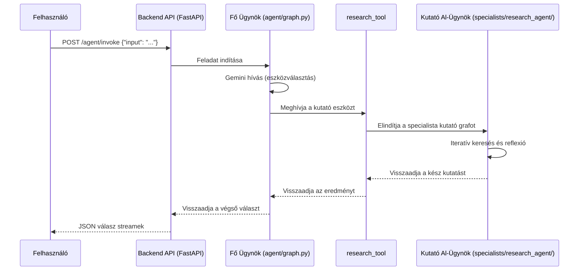

# BrunellaAgentSystem Működési Folyamata (Workflow)

Ez a dokumentum a rendszer belső működési folyamatait és architekturális felépítését írja le.

## 1. Magas Szintű Architektúra

A rendszer egy **hierarchikus, több-ügynökös modellt** valósít meg, ahol egy központi **Orchestrator** ügynök fogadja a kéréseket, és a feladat természetétől függően specializált eszközöket vagy al-ügynököket hív meg.

### Folyamatábra (Flowchart)

```mermaid
flowchart TD
    A[Orchestrator Agent\n(Fő Graf)] -->|Feladat Értelmezése| B{Eszköz Választás}
    B -->|Kutatási feladat| C[research_tool]
    B -->|Kódolási feladat| D[qwen3_coder_tool]
    C --> E[Specialista Kutató Al-Ügynök]
    E -->|Eredmény| A
    D -->|Eredmény| A
```

## 2. Részletes Működési Folyamat (Sequence Diagram)

A felhasználótól a válaszig tartó teljes folyamat a következőképpen néz ki:



## 3. A Specialista Kutató Al-Ügynök Működése

A rendszer legkomplexebb része a `research_tool` által meghívott kutató al-ügynök. Ez nem egyetlen lépés, hanem egy önálló, ciklikus folyamat:

1.  **Query Generálás:** A kapott témából több, specifikus keresési kulcsszót generál.
2.  **Web Keresés:** Minden kulcsszóra valódi Google keresést hajt végre.
3.  **Reflexió:** Az eredményeket kiértékeli, és megállapítja, hogy elegendő-e az információ. Ha nem, megnevezi a hiányosságokat.
4.  **Iteráció:** Ha hiányosságot talál, újabb, pontosító kereséseket indít. Ezt a ciklust a beállított maximumig ismétli.
5.  **Válasz Összegzés:** Amikor a kutatás teljes, egyetlen, forrásokkal ellátott válasszá szintetizálja az eredményeket.

Ez az architektúra lehetővé teszi a robusztus, mélyreható és önmagát javító kutatási feladatok elvégzését.