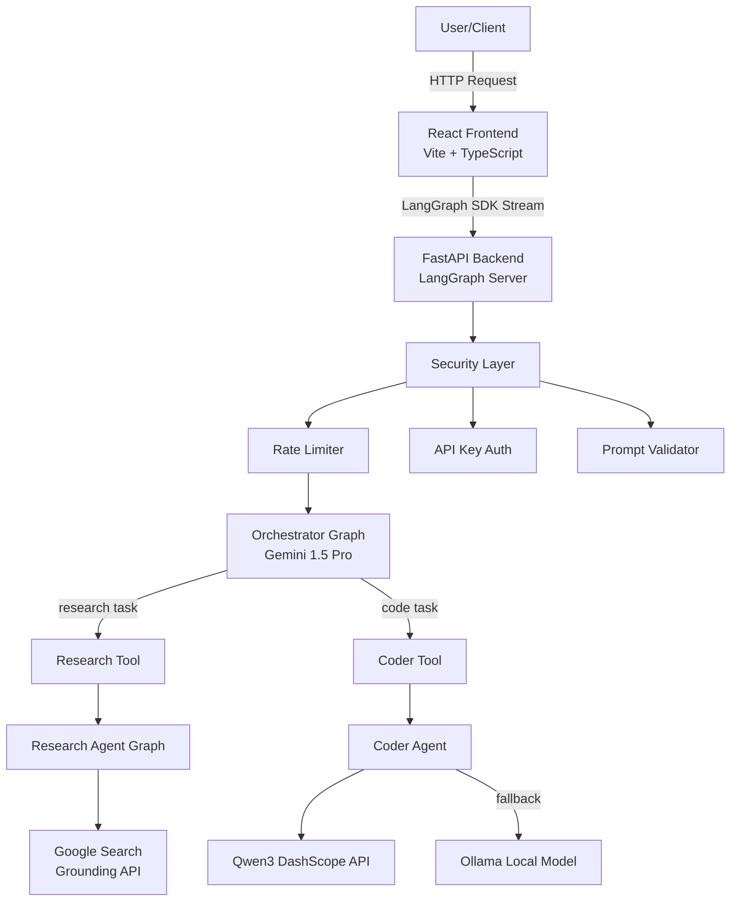
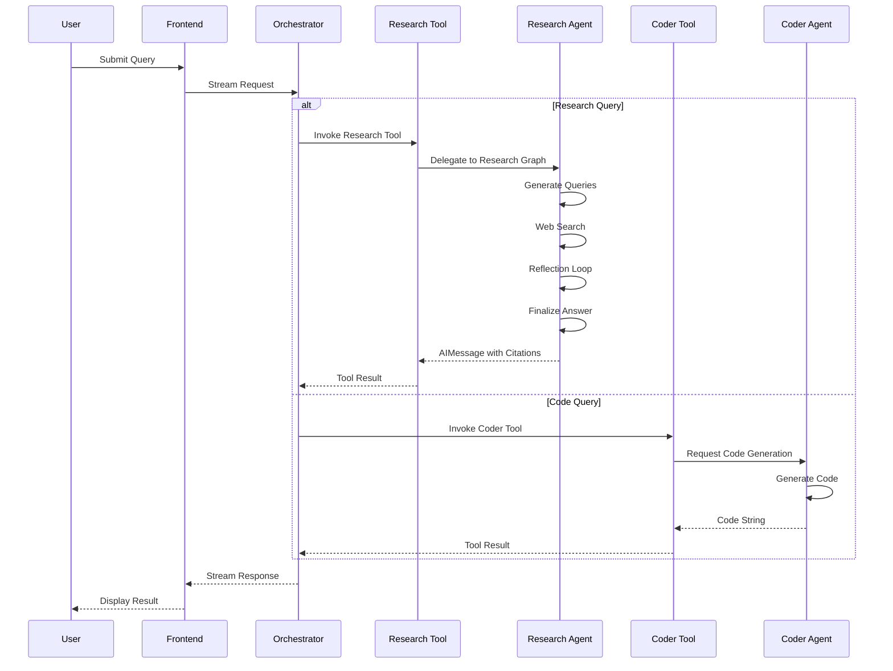
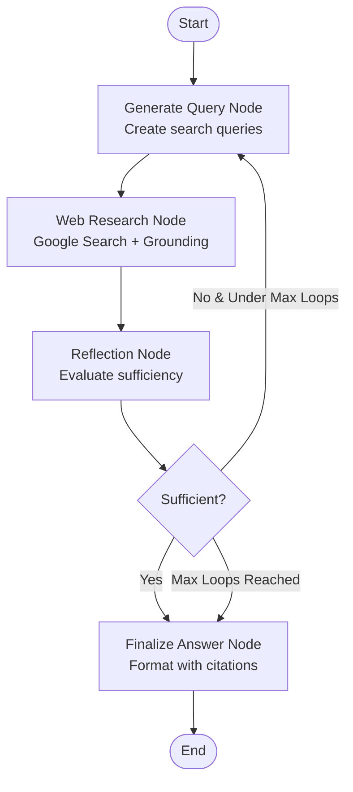

# BrunellaAgentsSystem Architecture

This document provides a detailed overview of the BrunellaAgentsSystem architecture, explaining how the different components interact to provide an intelligent multi-agent AI system.

## Table of Contents

1. [System Overview](#system-overview)
2. [Architecture Diagram](#architecture-diagram)
3. [Backend Architecture](#backend-architecture)
4. [Frontend Architecture](#frontend-architecture)
5. [Communication Flow](#communication-flow)
6. [State Management](#state-management)
7. [Security Architecture](#security-architecture)

## System Overview

BrunellaAgentsSystem is a hierarchical multi-agent AI system built on LangGraph. The system consists of:

- **Orchestrator**: A central coordinator (Gemini 1.5 Pro) that receives user requests and delegates to specialists
- **Research Specialist**: A dedicated agent for web research with grounding capabilities
- **Coder Specialist**: A code generation agent using Qwen3 Coder or OpenAI-compatible models
- **Frontend**: A React-based UI that streams updates in real-time

## Architecture Diagram

### High-Level System Architecture



### Orchestrator Message Flow



### Research Agent Internal Flow



## Backend Architecture

### Directory Structure

```
backend/
├── src/
│   ├── agent/              # Orchestrator graph
│   │   ├── graph.py        # Main orchestrator logic
│   │   └── tools.py        # Tool wrappers for specialists
│   ├── specialists/        # Specialist agents
│   │   ├── research_agent/ # Research specialist
│   │   │   ├── graph.py    # Research graph
│   │   │   ├── state.py    # State definitions
│   │   │   ├── prompts.py  # System prompts
│   │   │   └── tools_and_schemas.py
│   │   └── coder_agent.py  # Coder specialist
│   ├── utils/              # Shared utilities
│   │   ├── middleware.py   # API key auth
│   │   ├── prompt_validator.py # Security
│   │   ├── logging_config.py   # Logging
│   │   └── secrets.py      # Secret management
│   └── app.py              # FastAPI application
├── tests/                  # Test suite
└── langgraph.json         # LangGraph configuration
```

### Key Components

#### Orchestrator (agent/graph.py)

- **Purpose**: Route user requests to appropriate specialists
- **Model**: Gemini 1.5 Pro with tool-calling
- **Tools**: `research_tool`, `qwen3_coder_tool`
- **State**: `AgentState` - Union of messages for conversation history

#### Research Specialist (specialists/research_agent/)

A complete LangGraph with 4 nodes:

1. **generate_query**: Creates optimized search queries
2. **web_research**: Executes searches with Google Grounding API
3. **reflection**: Evaluates if information is sufficient
4. **finalize_answer**: Composes final answer with citations

**Configuration Options**:
- `initial_search_query_count`: Number of initial queries (default: 3)
- `max_research_loops`: Maximum reflection iterations (default: 2)
- `reflection_model`: Model for reflection (default: gemini-2.0-flash-exp)

#### Coder Specialist (specialists/coder_agent.py)

- **Primary**: Qwen3 Coder via DashScope API
- **Fallback**: Ollama local model (e.g., `qwen3:7b`)
- **Output**: Raw code only, no explanations

### State Schemas

#### Orchestrator State

```python
class AgentState(TypedDict):
    messages: Annotated[list, add_messages]
```

#### Research Agent State

```python
class OverallState(TypedDict):
    messages: list[BaseMessage]
    web_research_result: list[str]
    sources_gathered: list[dict]
    search_query: list[str]
    research_loop_count: int
    is_sufficient: bool
    knowledge_gap: str
    follow_up_queries: list[str]
```

## Frontend Architecture

### Tech Stack

- **Framework**: React 18 + TypeScript
- **Build Tool**: Vite
- **UI Library**: Radix UI components
- **Styling**: TailwindCSS
- **State**: React hooks (useState, useEffect)
- **Streaming**: LangGraph SDK Client

### Key Components

- **App.tsx**: Main container with LangGraph client initialization
- **ChatMessagesView.tsx**: Message display with streaming updates
- **AgentGraph.tsx**: Visual monitoring panel (right sidebar)

### API Communication

```typescript
const client = new Client({ 
  apiUrl: import.meta.env.DEV 
    ? "http://localhost:8000/agent" 
    : "/agent" 
});

// Stream assistant responses
for await (const chunk of streamResponse) {
  if (chunk.event === "messages/partial") {
    // Update UI with partial message
  }
}
```

## Communication Flow

### Request Flow

1. **User Input** → Frontend collects user query
2. **Validation** → Frontend validates before sending
3. **Stream Initiation** → LangGraph SDK creates stream
4. **Middleware** → Backend applies auth, rate limiting, validation
5. **Orchestrator** → Determines task type via LLM tool-calling
6. **Specialist** → Executes specialized task
7. **Response Stream** → Chunks sent back to frontend
8. **UI Update** → React components update in real-time

### Tool Invocation Flow

```python
# Orchestrator invokes tool
result = research_tool.invoke({"query": user_question})

# Tool delegates to specialist graph
research_result = research_graph.invoke(initial_state)

# Result returned to orchestrator
return {"messages": [AIMessage(content=result)]}
```

## Security Architecture

### Layers of Protection

1. **API Key Authentication**
   - Middleware checks `X-API-Key` header
   - Public paths: `/health`
   - Configurable via `API_KEY` environment variable

2. **Rate Limiting**
   - `/coder/generate`: 10 requests/minute per IP
   - Uses `slowapi` library
   - Returns 429 on limit exceeded

3. **Prompt Injection Protection**
   - 14+ blocked patterns (system override, script injection, role manipulation)
   - Applied via Pydantic field validator
   - Logs suspicious attempts

4. **Input Validation**
   - Language whitelist for code generation
   - Maximum prompt length (5000 chars)
   - Empty string rejection

### Security Logging

All security events are logged at WARNING level or higher:
- Invalid API keys
- Rate limit violations
- Blocked prompt injection attempts

## Deployment Architecture

### Local Development

```
Docker Compose Stack:
├── Backend Container (Port 8000)
│   └── LangGraph Dev Server
├── Frontend Container (Port 3000)
│   └── Nginx serving React build
└── Environment Variables
    └── Loaded from .env file
```

### Production (Cloud Run)

```
Cloud Run Services:
├── Backend Service
│   ├── Artifact Registry Image
│   ├── Secret Manager (API Keys)
│   └── Auto-scaling (0-100 instances)
└── Frontend Service
    ├── Artifact Registry Image
    ├── Static Nginx serve
    └── Backend URL via env var
```

## Configuration

### Environment Variables

| Variable | Purpose | Default |
|----------|---------|---------|
| `GEMINI_API_KEY` | Orchestrator & Research models | Required |
| `QWEN_API_KEY` | Qwen3 Coder API | Optional |
| `API_KEY` | API authentication | Optional |
| `LOG_LEVEL` | Logging verbosity | INFO |
| `ENVIRONMENT` | dev/production mode | development |
| `ALLOWED_ORIGINS` | CORS origins | localhost:5173,3000 |

### LangGraph Configuration (langgraph.json)

```json
{
  "dependencies": ["."],
  "graphs": {
    "agent": "src.agent.graph:graph"
  },
  "http": {
    "app": "src.app:app"
  },
  "env": ".env"
}
```

## Extending the System

### Adding a New Specialist

1. Create specialist module in `src/specialists/`
2. Implement as LangGraph or simple chain
3. Add tool wrapper in `src/agent/tools.py`
4. Bind tool in `src/agent/graph.py`
5. Update orchestrator system prompt if needed

### Adding New Security Rules

1. Add patterns to `src/utils/prompt_validator.py`
2. Add tests in `tests/test_prompt_validation.py`
3. Update documentation

## Performance Considerations

- **Streaming**: Real-time updates reduce perceived latency
- **Parallel Queries**: Research agent runs multiple searches concurrently
- **Rate Limiting**: Prevents cost explosion from abuse
- **Lazy Initialization**: Models/clients created only when needed
- **Caching**: Docker BuildKit cache for faster builds

## Monitoring and Observability

- **LangSmith**: Optional tracing (set `LANGSMITH_API_KEY`)
- **Structured Logging**: JSON format in production
- **Health Endpoint**: `/health` for uptime checks
- **Error Handling**: HTTPException with appropriate status codes

---

**Last Updated**: December 2025  
**Version**: 1.0  
**Maintainer**: BrunellaAgentsSystem Team
