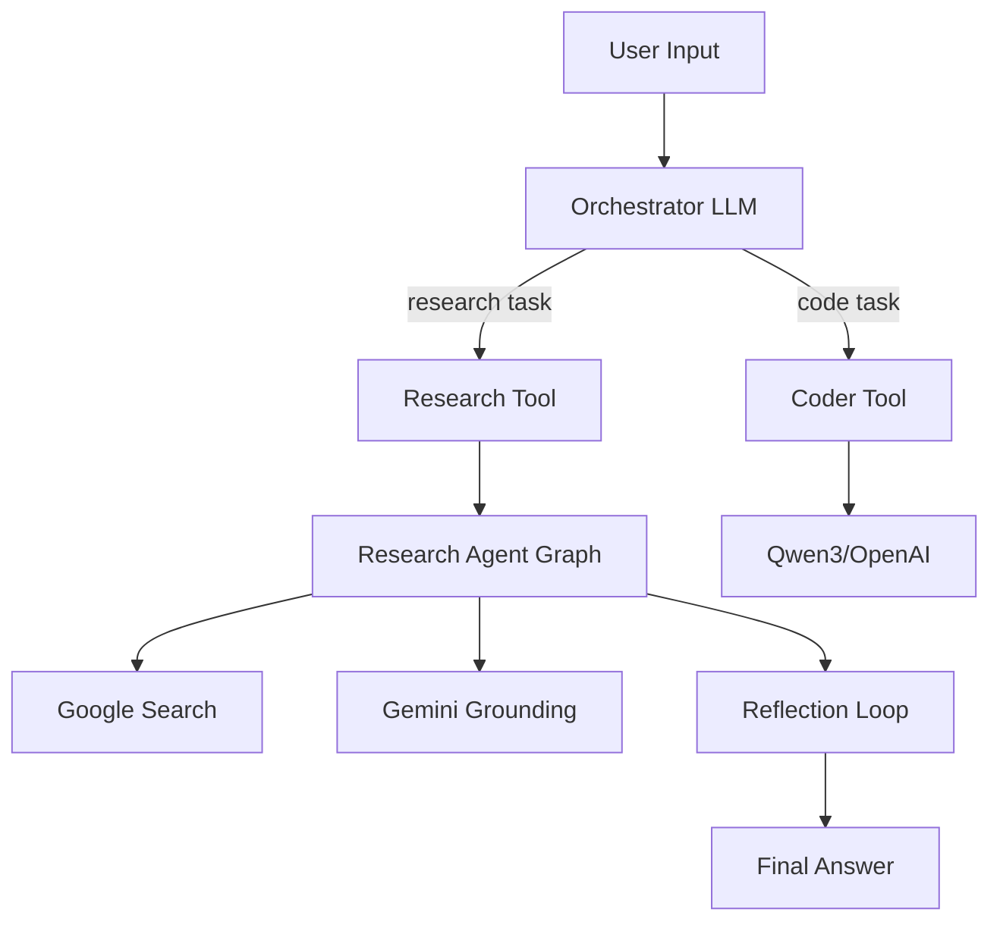

# BrunellaAgentsSystem Architecture

This document provides a detailed overview of the BrunellaAgentsSystem's architecture, outlining the hierarchical graph structure, communication flows, and key components.

## High-Level Overview

The BrunellaAgentsSystem is a multi-agent AI system built on the LangGraph framework. It is designed to handle complex tasks by breaking them down into smaller, manageable sub-tasks that are delegated to specialized agents. The system is composed of a central **Orchestrator** and a set of **Specialists**.

## Hierarchical Graph Structure

The system's architecture is hierarchical, with the Orchestrator at the top, delegating tasks to the appropriate Specialist.

### Orchestrator

The Orchestrator is the central component of the system, responsible for:

-   Receiving user requests.
-   Analyzing the request to determine the appropriate specialist.
-   Delegating the task to the selected specialist.
-   Returning the final result to the user.

### Specialists

Specialists are specialized agents that are designed to handle specific tasks. The current implementation includes two specialists:

-   **Research Agent**: Responsible for conducting research on a given topic using web searches and grounding the results.
-   **Coder Agent**: Responsible for generating code in various programming languages based on a natural language prompt.

## Message Flow

The following Mermaid diagram illustrates the message flow within the system:

## State Schema

The system's state is managed by LangGraph and is passed between the nodes in the graph. The state is a dictionary that contains all the information necessary for the system to function, including:

-   `messages`: A list of messages between the user and the system.
-   `search_query`: The search query generated by the research agent.
-   `web_research_result`: The results of the web search.
-   `sources_gathered`: A list of sources found during the research.
-   `is_sufficient`: A boolean indicating whether the research is complete.
-   `knowledge_gap`: A string describing any knowledge gaps identified during the research.
-   `follow_up_queries`: a list of follow up queries to fill the knowledge gap.
-   `research_loop_count`: The number of research loops that have been completed.

## Tool Calling Mechanism

The system uses tools to interact with the outside world. Tools are functions that can be called by the agents to perform specific tasks, such as searching the web or generating code. The tool calling mechanism is as follows:

1.  The agent's LLM determines that it needs to call a tool.
2.  The LLM generates a tool call, which is a JSON object that specifies the tool to be called and the arguments to be passed to it.
3.  The tool call is executed, and the result is returned to the agent.
4.  The agent uses the tool's result to continue its task.

## Frontend ↔ Backend Communication

The frontend and backend communicate via a WebSocket connection, which is managed by the LangGraph SDK. The frontend sends user requests to the backend, and the backend streams the results back to the frontend in real-time.
